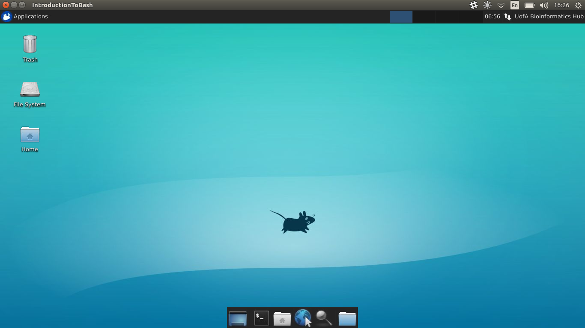

# Windows Setup
{:.no_toc}

* TOC
{:toc}

For those running Windows, we could probably perform about half of today's session on your computer.
However, as many tools rely on the fundamental architecture of OSX & Linux systems, not all tools are available.
The best solution for today's session is to use a Virtual Machine (VM) which we have configured for you.
This is essentially a computer running somewhere else (i.e. the "*cloud*") which we can log onto remotely.

## Install X2GO

To setup a connection to this VM we first need to install the client software X2GO, which can be obtained [from here](https://code.x2go.org/releases/binary-win32/x2goclient/releases/4.1.0.0-2017.03.11/x2goclient-4.1.0.0-2017.03.11-setup.exe).
Once you've installed this software, **ask the instructors for an IP address and password.**

## Connect To a VM

To connect to your VM, please follow these instructions carefully.
First, we need to create a session with the basic parameters, then we'll actually log in.

1. Open X2GO
2. Enter *Intro-NGS* as the Session Name
3. Enter your *IP address* where it says *Host*
4. Enter the word `ubuntu` as the login. **This must be all lower-case**
5. Select XFCE from the `Session type` drop-down menu
6. Click OK

Now we have created the session, it will appear in X2Go on the right panel.
To log onto the VM, we simply click on the session, and enter the password you were given.
Click OK if you receive a message about a security key.
*If this process fails, please place a post-it note on your monitor.*

**We advise maximising your X2Go window to replicate sitting at the VM as if it is your local machine.**

Once you've logged in you should see a desktop like the one below.
To open the terminal, click the *terminal icon* at the bottom of the screen.



## Install Today's software

Unfortunately, we still need to install a few programs on the VMs to really get today running smoothly.
Open a terminal and paste the following commands one line at a time.

```
cd
rm -R opt
sudo apt-get autoremove
sudo apt-get install cmake
sudo apt-get install fastqc
sudo apt-get install picard-tools
```

- To install `bamtools` we need to clone the software using `git`, then use `cmake` & `make`.
(The following can be copied and pasted as a single command.)

```
cd /opt
sudo git clone https://github.com/pezmaster31/bamtools
cd bamtools
sudo mkdir build
cd build
sudo cmake ..
sudo make
sudo make install
echo 'export PATH="/opt/bamtools/lib:$PATH"' >> ~/.bashrc
source ~/.bashrc
```

- Next we'll need to install `freebayes` which we'll use later for variant calling

```
cd /opt
sudo git clone --recursive git://github.com/ekg/freebayes.git
cd freebayes
sudo make
echo 'export PATH="/opt/freebayes/bin:$PATH"' >> ~/.bashrc
source ~/.bashrc
```

- We'll also use `sabre` for demultiplexing

```
cd /opt
sudo git clone https://github.com/najoshi/sabre.git
cd sabre
sudo make
echo 'export PATH="/opt/sabre:$PATH"' >> ~/.bashrc
source ~/.bashrc
```


[Home](../)
