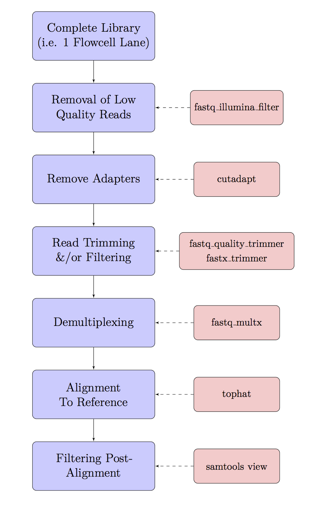

* TOC
{:toc}

# Trimming and quality filtering of NGS data

Once we have inspected our data & have an idea of how accurate our reads are, as well as any other technical issues that may be within the data, we may need to trim or filter the reads to make sure we are aligning or analysing sequences that accurately represent our source material.  As we’ve noticed, the quality of reads commonly drops off towards the end of the reads, and dealing with this behaviour is an important part of most  processing pipelines.  Sometimes we will require reads of identical lengths for our downstream analysis, whilst other times we can use reads of varying lengths.  The data cleaning steps we choose for our own analysis will inevitably be influenced by our downstream requirements.

## The Basic Workflow

Data cleaning & pre-processing can involve many steps, and today we will use the basic work-flow as outlined in the following flow chart.  Every analysis is slightly different so some steps may or may not be required for your own data.  Some steps do have a little overlap, and some pipelines (e.g. *Stacks*) may perform some of these steps for you.

Using today’s datasets, we will take one sequencing through demultiplexing and adapter removal, and then use our *C. elegans* WGS to run genome mapping and alignment filtering. We will perform most steps on files at this stage, rather than on a complete library, but the principle is essentially the same



## Demultiplexing

In the previous section "Understanding NGS Data \& FASTQ Format" we discussed the difference between an *index* and a *barcode*. If you use an indexed adapter to distinguish samples on an Illumina sequencing run, the demultiplexing is *usually* done on the sequencing machine. However, sometimes it makes sense to use a barcode (or sometimes called "inline barcode"), to further multiplex samples onto one sequencing run.

While barcode can be incredibly useful, it is important to note that Illumina cycle calibration and cluster calling is done in the first 4 cycles (first four base-pairs of read 1). It also is used to establish other metrics (e.g., signal thresholds) for base-calling.
Therefore it is essential that the first four base pairs are "diverse" (i.e. no particular nucleotide is over-represented in the first four base-pairs). Designing the right barcodes to add to the start of your reads extremely important!

Additionally, the Illumina NextSeq machine's have a slighly different sequence setup to the other sequencing machines (MiSeq, HiSeq and GAII's), using two-channel sequencing, which requires only two images to encode the data for four DNA bases, one red channel and one green channel. Guanine is an absence of colour and therefore at least one base other than G most be present in the [first two cycles](http://blog.kokocinski.net/index.php/barcode-balancing-for-illumina-sequencing?blog=2).

For more information on Illumina cluster density and other technical aspects of cycles and imaging, [read the following Illumina support material](https://support.illumina.com/content/dam/illumina-marketing/documents/products/other/miseq-overclustering-primer-770-2014-038.pdf).

To demonstrate demultiplexing we will use the a sequencing run with two samples that have a 7bp barcode. However, to do this we'll first need to download some example data that has barcodes attached to the start of the sequence:

```
cd ~
wget -c "https://universityofadelaide.box.com/shared/static/gje9uq74b8kies32to699jyjbs5l81jb.gz" -O "multiplexed.tar.gz"
tar xzvf multiplexed.tar.gz
mkdir -p multiplexed/rawData/fastq
mv *fastq.gz multiplexed/rawData/fastq
cd multiplexed/rawData/fastq
```

You should now have a raw sequence file called "Run1" with two pairs "Run1_R1.fastq.gz" and "Run1_R2.fastq.gz". Along with this is a text file with the barcode information.

Our barcode sequences should be "GCGTAGT" (for bc1) and "CCTCGTA" (for bc2). Lets first see what possible barcodes are available in the first 7bp of our dataset and see if it matches what we expect:


```
zcat Run1_R1.fastq.gz | sed -n '2~4p' | cut -c 1-7 | sort | uniq -c | sort -nr | head -n10
```

What top 5 barcodes are found in our data? Do the top two reflect our the barcodes we should have?

The command above is quite long and contains multiple unix commands that are separated by a pipe. What does each command do?

| Command | Explanation |
|---------|-------------|
| `zcat Run1_R1.fastq.gz` | Prints the compressed fastq file to screen |
| `sed -n '2~4p'` | Prints the second line (sequence of each fastq file) |
| `cut -c 1-7` | Get the first 7 characters |
| `sort` | sort the sequences |
| `uniq -c` | Find the unique 7 characters are count them |
| `sort -nr` | sort the sequences and reverse the order |
| `head -n10` | Print the top 10 |

Our real barcodes are actually in a file called barcodes_R1.txt. Unfortunately, sabre only runs with uncompressed data, so to run this program we'll need to ungzip our fastq files.

```
gunzip Run1_R1.fastq.gz
gunzip Run1_R2.fastq.gz
sabre pe -m 1 -f Run1_R1.fastq -r Run1_R2.fastq -b barcodes_R1.txt \
  -u unknown_barcode1.fastq -w unknown_barcode2.fastq
```

How many read pairs were extracted in each sample?

Run the command again without the one mismatch. How many read are now in each?

## Removal of Low Quality Reads and Adapters

Adapter removal is an important step in many sequencing projects, mainly projects associated with small DNA/RNA inserts. For example, a common RNAseq experiment is to sequence small non-coding RNAs that are generated by an indvidual to regulate other coding sequences. These small RNAs (namely miRNAs, snoRNAs and/or siRNAs) are generally between 19-35bp, which is significantly smaller than the shortest, standard read length of most Illumina MiSeq/NextSeq/HiSeq machines (usually have read length settings such as 50, 75, 100, 125, 250 or 300bp). Therefore it is important to trim adapters accurately to ensure that the genome mapping and other downstream analyses are accurate.

In previous workshops we would run multiple steps to remove both low-quality reads, but today's trimming algorithms have become better at removing low-quality data and the same time as removing adapters.

The tool we'll use today is `cutadapt` \& it's one of the few bioinformatics tools to have a helpful webpage, [so head to the site](http://cutadapt.readthedocs.org/).


Now we can trim the raw data using the Illumina Nextera paired-end adapters obtained from [this website](https://support.illumina.com/bulletins/2016/12/what-sequences-do-i-use-for-adapter-trimming.html)
These are commonly used in Illumina projects.

Before we perform adapter trimming, look at the following code.

```
cd ~/WGS
mkdir -p trimmedData/fastq
cutadapt -m 35 -q 20 -a CTGTCTCTTATACACATCT -A CTGTCTCTTATACACATCT \
    -o trimmedData/fastq/SRR2003569_sub_1.fastq.gz -p trimmedData/fastq/SRR2003569_sub_2.fastq.gz \
    rawData/fastq/SRR2003569_sub_1.fastq.gz rawData/fastq/SRR2003569_sub_2.fastq.gz > cutadapt.log
```

#### Question
{:.no_toc}
*1. What did the settings* `-m 35` *and* `q 20` *do in the above?*

The `cutadapt` tool produces a large amount of information about the trimming process
In the above we wrote this output to a log file using the `>` symbol to redirect `stdout` to a file.
Let's have a look in the file to check the output.

```
less cutadapt.log
```

As these were a good initial sample, it's not surprising that we didn't lose many sequences.
Notice that many reads were trimmed, but were still long enough and high enough quality to be retained.

The relatively even spread of A/C/G/T bases after the adapters also indicates that we've not missed anything.
Sometimes, if we've missed a base in the adapter you'll see a strong bias in the first base after adapter removal.

### FastQC

Before moving on, we need to check the quality of the trimmed sequences, so let's run `fastqc` on these files to check them out.

```
mkdir -p trimmedData/FastQC
fastqc -o trimmedData/FastQC -t 2 trimmedData/fastq/*gz
```
#### Question
{:.no_toc}
*Was there much of an improvement in the trimmed data?*
